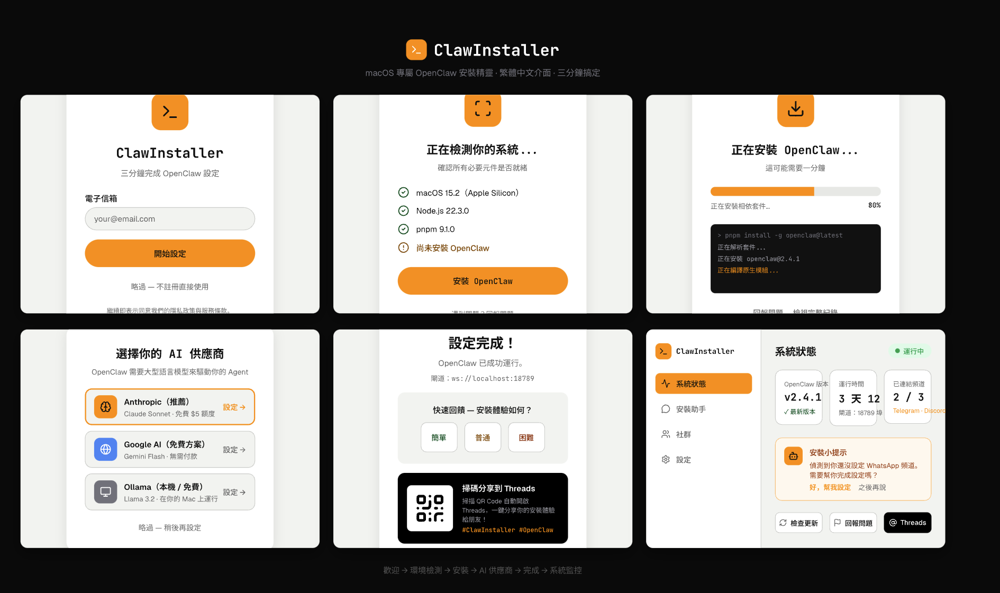

<h1 align="center">🐾 ClawInstaller</h1>

<p align="center">
  <strong>macOS 安裝精靈 — 讓 OpenClaw 設定從 30 分鐘變成 3 分鐘</strong>
</p>

<p align="center">
  <a href="https://swift.org"></a>
  <a href="https://www.apple.com/macos"></a>
  <a href="LICENSE"></a>
  <a href="https://www.threads.net/@0xhoward_peng"></a>
</p>

<p align="center">
  <a href="README.en.md">English</a> · <a href="https://t.me/clawinstaller">Telegram 群組</a> · <a href="https://www.threads.net/@0xhoward_peng">Threads</a>
</p>

> **獨立社群專案，為 OpenClaw 生態而生。**

---

<p align="center">
  
</p>

## 為什麼需要 ClawInstaller？

[OpenClaw](https://github.com/openclaw/openclaw) 擁有 **257K+ stars**，是最受歡迎的開源 AI Agent 框架之一。但安裝流程對新手極不友好：

| 痛點 | 比例 | ClawInstaller 怎麼解決 |
|------|------|----------------------|
| Node.js 版本錯誤、缺原生套件 | ~35% | 一鍵偵測 + 自動修復 |
| 設定檔困惑（JSON、API Key） | ~25% | 引導式圖形化設定 |
| 裝好了但跑不起來 | ~15% | 智慧錯誤診斷 + 修復建議 |

**我們自動化最痛苦的前 5 分鐘** — 大多數人放棄的那個階段。

## 功能一覽

| 模組 | 狀態 | 說明 |
|------|------|------|
| 🔍 **環境檢測** | ✅ 完成 | 偵測 Node.js ≥22、套件管理器、架構、磁碟空間 |
| 📦 **一鍵安裝** | 🔧 開發中 | 支援 npm/pnpm/bun，即時進度顯示 |
| 📡 **頻道設定** | ✅ 完成 | Telegram、Discord、WhatsApp 引導式設定 |
| 🤖 **AI 供應商** | ✅ 完成 | Anthropic、Google AI、Ollama 一鍵設定 |
| 📊 **系統監控** | 📋 計畫中 | Gateway 狀態、daemon 啟停、日誌檢視 |
| 💬 **安裝助手** | 📋 計畫中 | AI 驅動的疑難排解（免費額度，我們請客） |

## 安裝流程

```
歡迎 → 環境檢測 → 一鍵安裝 → AI 供應商 → 頻道設定 → 完成！
         │                                           │
    發現問題？                                  掃 QR Code
    一鍵自動修復                              分享到 Threads
```

## 錯誤處理

遇到問題不用慌 — ClawInstaller 自動診斷並提供修復方案：

| 錯誤情形 | 修復方式 |
|---------|---------|
| Node.js 未安裝 | 一鍵自動安裝 via Homebrew |
| 原生模組編譯失敗 | 一鍵安裝 Xcode CLI Tools |
| 網路連線逾時 | 重新嘗試 / 切換鏡像源 |

## 痛點追蹤

ClawInstaller 內建匿名使用分析（可關閉），幫助我們了解：

- 用戶最常卡在哪一步？
- 哪些錯誤最頻繁出現？
- 安裝成功率和平均耗時

這些數據回饋到產品改進 — **你遇到的問題，會讓下一個人更順暢**。

## 快速開始

```bash
git clone https://github.com/clawinstaller/claw-installer.git
cd claw-installer
swift build
swift run ClawInstaller
```

> **系統需求：** macOS 14+（Sonoma）、Xcode 15+ 或 Swift 6.0 工具鏈

## 定價

| 方案 | 內容 | 費用 |
|------|------|------|
| **免費** | 環境檢測 + 安裝 + 頻道設定 + 監控 | $0 |
| **AI 助手** | AI 驅動的安裝疑難排解 | 免費額度（我們請客） |

## 開發路線

- [x] 環境檢測 + 一鍵修復
- [x] 頻道設定（Telegram、Discord、WhatsApp）
- [x] AI 供應商設定（Anthropic、Google AI、Ollama）
- [x] UI 設計：全繁中安裝流程
- [ ] 一鍵安裝精靈（開發中）
- [ ] 系統監控面板
- [ ] AI 安裝助手
- [ ] Threads QR Code 分享
- [ ] Homebrew Cask formula
- [ ] Demo 影片

## 社群

- **Threads**: [@0xhoward_peng](https://www.threads.net/@0xhoward_peng) — 追蹤獲取更新
- **Telegram**: [@clawinstaller](https://t.me/clawinstaller) — 繁中使用者群組

安裝完成後掃描 QR Code 即可分享安裝體驗到 Threads！

## 貢獻

早期階段 — 歡迎各種貢獻：

1. **測試** — 在你的 Mac 上測試，回報問題
2. **分享痛點** — 告訴我們 OpenClaw 安裝時遇到什麼困難
3. **PR 歡迎** — 查看 [open issues](https://github.com/clawinstaller/claw-installer/issues)

## 授權

[MIT](LICENSE)

---

<p align="center">
  由 <a href="https://github.com/howardpen9">@howardpen9</a> 搭配 OpenClaw agents（Friday、Shuri、Muse）共同打造
</p>
